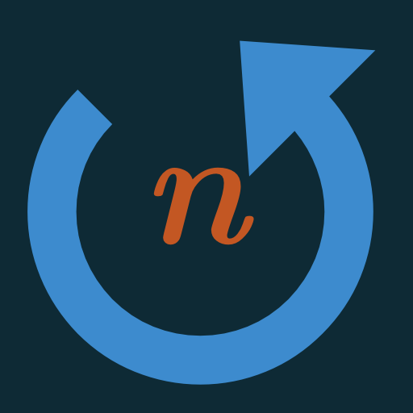

#  nb

A visual-only PWA for the [n-back task](https://en.wikipedia.org/wiki/N-back) with dual and triple modes.

Most n-back implementations use audio cues. This one uses only visual elements (position, color, and optionally letters), designed for focused cognitive training sessions.

## Features

- **Dual mode**: Track position and color
- **Triple mode**: Track position, color, and letters
- **Quad mode**: Track position, color, letters, and shapes (using `clip-path`)
- **Session tracking**: Achievement icons appear for each completed 100-round session (stored per day)
- **Dual progress indicators**:
  - Grey fill shows overall session progress
  - Colorful gradient shows perfect round momentum (only increases when all dimensions are correct)
- **Milestone celebrations**: Subtle fireworks at 20, 40, 60, and 80 rounds
- **Keyboard support**: Full keyboard controls for desktop use
- **Responsive design**: Works on mobile (portrait) and desktop

## Usage

### Setup

Click any square (1-9) to set the n-back level. Click the same square again to cycle between **Dual**, **Triple**, and **Quad** modes. The level indicator at the top shows the current level and mode (e.g., "3₄" for 3-back quad mode).

### Starting and Pausing

- **Start**: Click the level number at the top or anywhere in the bottom area
- **Pause**: Click the center area during gameplay
- **Resume**: Close the pause modal or press Space/Escape

Sessions run for 100 rounds (~5 minutes per session). Progress is shown in the top-right with a brain or battery icon.

### Controls

**Touch/Mouse:**

- Left edge: Position matches n steps ago
- Right edge: Color matches n steps ago
- Bottom center (triple mode): Letter matches n steps ago
- Bottom split buttons (quad mode):
  - Left: Letter matches n steps ago
  - Right: Shape matches n steps ago

**Keyboard:**

- `Z`: Position
- `C`: Color
- `X`: Letter (triple/quad mode)
- `V`: Shape (quad mode)
- `Space`: Start/Pause/Resume
- `?`: Show help
- `Escape`: Close modals

Press again to toggle answers off. Multiple dimensions can be selected per round.

### Feedback

- **Green flash**: Correct answer
- **Red flash**: Incorrect answer
- **Grey progress fill**: Overall session progress (0-100 rounds)
- **Colorful fire fill**: Perfect round streak (increases only when all dimensions are correct)
- **Fireworks**: Milestone celebrations at rounds 20, 40, 60, 80
- **Progress grid**: 10×10 matrix in pause/results modals showing per-round correctness
  - Each cell represents one round, split into horizontal bars (position/color/letter/shape)
  - Green bars = correct, red bars = incorrect
  - Makes failure clusters and patterns immediately visible

## Session Data

Completed sessions (100 rounds) are tracked using IndexedDB. Achievement icons appear in the play area showing today's completed sessions. Icons are randomly selected from: star, medal, trophy, brain, graduation cap, lightning, and fist.

Session data includes per-round correctness results (stored compactly for future analysis) which power the progress grid visualization.

## Training Calendar

Click the brain/battery progress icon (when not playing) to view your training history in a calendar format.

**Calendar Features:**

- Monthly calendar view (European format: starts on Monday)
- Days with sessions are highlighted in green with session count
- Navigate between months using arrow buttons
- Click any day to see detailed session list with mini progress grid previews
- Each session shows: level, mode, time (24-hour format), and performance percentages

**Session Details:**

- Click any session card to view full statistics and complete progress grid
- Compact date format (YYYYMMDD @ HH:MM) for easy scanning
- Back button returns to calendar view

**Export Data:**

- Floppy disk icon in calendar view exports all session data as JSON
- Filename includes timestamp (e.g., `nb-2026-02-11T12-34-56.json`)
- Uses Web Share API on supported devices, downloads otherwise
- Useful for backup or external analysis

## Technical Notes

- Phosphor icons for UI elements
- Canvas-based particle effects (fire and fireworks)
- PWA-ready with service worker support
- Haptic feedback on iOS devices
- Monospace (Monoid) font for modals

